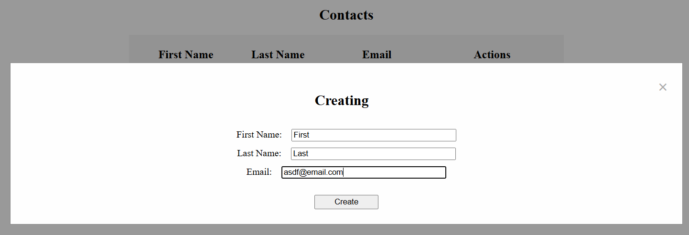

# Full-stack project

Stuff for me to remember:

1. Backend folder: python3 main.py
2. Fackend folder: npm run dev

## Introduction

Full stack is a LOT more work than I thought. I've actually done it before in one of my [college classes](https://github.com/ucsc2025-cse183/Beepered-code), but we weren't told that we were doing full-stack, so I thought it was all frontend.

I followed [this video](https://www.youtube.com/watch?v=PppslXOR7TA&t=3364s) by Tech with Tim. Originally, I followed it, then saw it did not show how to deploy the site, so I deleted my work and started a few different tutorials which were bad, then restarted with this one again.

## What is this project?

A small full stack website that allows you to put in a first name, last name, and email. You can update the information or delete it.

For the non-programmers:  
Frontend lets you see the information. Backend lets you add/delete information. You click button (frontend) which sends information to backend to do something.

## Tools Used

1. **Flask/Python**: backend
2. **React**: frontend, I prefer Vue.js

## What I learned

Full stack is a lot. I don't see myself making a full stack website on my own soon. Got to use Flask (good) and React (hate), and found that I like Python more than I thought. Python is very versatile.
