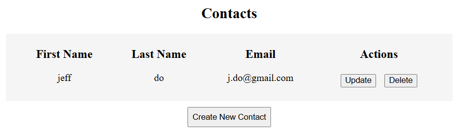

# Full-stack project

Stuff for me to remember:

1. Backend folder: python3 main.py
2. Fackend folder: npm run dev

## Introduction

Part 2 of trying to learn stuff each week. First week was [learning SQL](https://github.com/Beepered/SQL-Practice).

Full stack is a LOT more work than I thought. I've actually done it before in one of my [college classes](https://github.com/ucsc2025-cse183/Beepered-code), but we weren't told that we were doing full-stack, so I thought we were only doing frontend. It used py4web, instead of Flask, and Vue.js, instead of React. That is where I learned to use Vue.js and I still use it in my portfolio website.

I followed [this video](https://www.youtube.com/watch?v=PppslXOR7TA&t=3364s) by Tech with Tim. Originally, I followed it then saw that the tutorial did not show how to deploy it, so I deleted it and started a few different tutorials which wer bad, so I restarted with this one again.

## What is this project?

## Tools Used

1. **Flask/Python**: backend
2. **React**: frontend, I prefer Vue.js

## What I learned

Full stack is a lot. I don't see myself making a full stack website on my own soon. Got to use Flask (good) and React (hate), and found that I like Python more than I thought. Python is very versatile.
